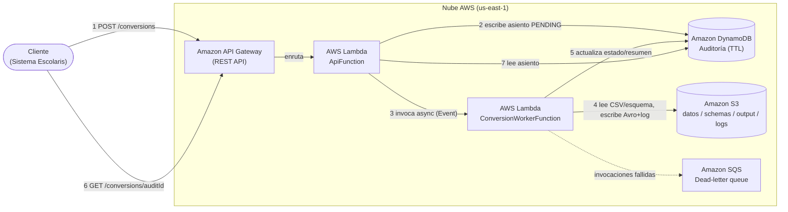

# Documento de Diseño

## Visión general

Esta solución expone una **REST API serverless** en AWS que convierte archivos **CSV** alojados en Amazon S3 a formato **Apache Avro**, aplicando un esquema definido en JSON y reglas de calidad (`qualityRules`). El procesamiento es **asíncrono**: `POST /conversions` acepta la solicitud, crea un asiento de auditoría y delega el trabajo en un worker invocado por evento; el cliente consulta el avance con `GET /conversions/{auditId}` mediante sondeo (polling).

El diseño separa la **lógica de negocio** (validación + serialización Avro, en `src/common/`) de los **handlers** (`src/api_handler/`, `src/conversion_worker/`), de modo que el negocio sea testeable de forma aislada e independiente del mecanismo de invocación (`csi-standards > Regla de oro 1`). Toda la infraestructura se define con AWS SAM.

Este documento cubre los Requerimientos 1 a 9 de `requirements.md`. El mapeo detallado está en la sección [Trazabilidad](#trazabilidad-requerimientos--diseño).

## Decisiones técnicas

| Área | Decisión | Justificación |
|---|---|---|
| Invocación del worker | Lambda asíncrona `InvocationType=Event` desde `ApiFunction` | Permite responder `202` de inmediato sin esperar la conversión (R7). Lambda gestiona la cola de eventos y reintenta ante fallo. [Lambda async error handling](https://docs.aws.amazon.com/lambda/latest/dg/invocation-async-error-handling.html) |
| Idempotencia | Worker idempotente respecto al `auditId`; salida determinista sobrescribible | La invocación asíncrona puede **entregar el mismo evento más de una vez** (la cola es eventualmente consistente) y reintenta por defecto 2 veces ante error de función. El código debe manejar duplicados (R8). [Lambda async error handling](https://docs.aws.amazon.com/lambda/latest/dg/invocation-async-error-handling.html) |
| Captura de fallos | Dead-letter queue (Amazon SQS) en el worker | Captura eventos descartados tras agotar reintentos, para diagnóstico; recomendado por `error-handling > Idempotencia`. [Lambda DLQ](https://docs.aws.amazon.com/lambda/latest/dg/invocation-async-retain-records.html) |
| Auditoría | Amazon DynamoDB on-demand con atributo `ttl` | Persistente y consultable (R4); on-demand evita administrar capacidad (R5). TTL expira asientos antiguos sin consumir throughput de escritura. [DynamoDB TTL](https://docs.aws.amazon.com/amazondynamodb/latest/developerguide/TTL.html) |
| Formato del `ttl` | Número en epoch Unix **en segundos** | DynamoDB ignora atributos TTL que no sean `Number` en segundos; el borrado ocurre dentro de unos días del vencimiento. [DynamoDB TTL](https://docs.aws.amazon.com/amazondynamodb/latest/developerguide/TTL.html) |
| Lectura de CSV | Streaming con el módulo estándar `csv` | Procesa archivos grandes sin cargarlos completos en memoria; alineado con `tech.md`. |
| Serialización Avro | `fastavro` | Sin dependencia de JVM; declarado en `tech.md`. |
| Resolución del esquema | Convención de nombre con override por `schemaKey` | `datos/{base}.csv` ↔ `schemas/{base}.json`, anulable por el request (R1.3, R1.4). |
| Nombre de estado final exitoso | `COMPLETED` | **Conflicto detectado:** `requirements.md` (R7.3) nombró el estado `DONE`, pero el estándar `api-standards > Estados` define `COMPLETED`. Se adopta `COMPLETED` por ser el estándar; se corrige `requirements.md` para mantener coherencia (`csi-standards > Regla de oro 7`). |

## Arquitectura

### Componentes

| Componente | Servicio AWS | Rol |
|---|---|---|
| REST API | Amazon API Gateway (REST) | Expone `POST /conversions` y `GET /conversions/{auditId}` |
| `ApiFunction` | AWS Lambda (Python 3.12) | Atiende HTTP; valida el request, crea el asiento `PENDING`, invoca el worker async y responde `202`; en `GET` lee el asiento |
| `ConversionWorkerFunction` | AWS Lambda (Python 3.12) | Invocada por evento; resuelve CSV/esquema, valida, serializa Avro, escribe log y actualiza el asiento |
| Repositorio oficial | Amazon S3 | Única fuente de verdad: prefijos `datos/`, `schemas/`, `output/`, `logs/` |
| Auditoría | Amazon DynamoDB (on-demand, `ttl`) | Estado y resumen del proceso por `auditId` |
| DLQ | Amazon SQS | Captura invocaciones del worker que agotan reintentos |

### Diagrama

> El entregable canónico es un `.drawio` bajo `Documents/` (`drawio-architecture`). El servidor MCP `drawio-architect` no está disponible en esta sesión, por lo que el diagrama se incluye aquí en Mermaid y queda **pendiente** generar `Documents/avro-rest-api-gateway-arquitectura.drawio` cuando el MCP se reconecte.



## API

Contrato alineado con `api-standards`. Siempre `Content-Type: application/json; charset=utf-8`; se omiten campos nulos **salvo `avroKey`** (null explícito).

### `POST /conversions` → `202 Accepted`

Request:
```json
{ "csvKey": "datos/alumnos.csv", "schemaKey": "schemas/alumnos.json" }
```
- `csvKey` (obligatorio): clave S3 del CSV.
- `schemaKey` (opcional): si se omite, se resuelve por convención de nombre.

Respuesta `202`:
```json
{ "status": "PENDING", "auditId": "a1b2c3d4-...", "statusUrl": "/conversions/a1b2c3d4-..." }
```
- `400` si falta `csvKey` o el JSON está mal formado. La existencia del CSV/esquema **no** se valida aquí: se verifica en el worker y se refleja vía `GET` (`error-handling > Dónde se refleja cada error`).

### `GET /conversions/{auditId}` → `200 OK` / `404`

Respuesta según estado:
- **PENDING / PROCESSING**: `{ "status": "...", "auditId": "..." }`
- **COMPLETED**: incluye `avroKey`, `logKey`, `totalRows`, `convertedRows`, `errorRows`, `fileSizeBytes`.
- **NO_VALID_RECORDS**: `avroKey: null` explícito, con `logKey` y contadores.
- **ERROR**: incluye `error` (código de negocio) y `message` descriptivo.
- `404` si el `auditId` no existe.

### Estados del procesamiento

```
PENDING ──► PROCESSING ──► COMPLETED
                       ├──► NO_VALID_RECORDS
                       └──► ERROR
```

### Códigos de error de negocio

| Código | Causa | Dónde se detecta |
|---|---|---|
| `CSV_NOT_FOUND` | `csvKey` no existe en `datos/` | Worker, al resolver archivos (R9.1) |
| `SCHEMA_NOT_FOUND` | Esquema (por `schemaKey` o convención) no existe en `schemas/` | Worker, al resolver archivos (R9.2) |
| `INVALID_SCHEMA` | El esquema no parsea / no es un esquema Avro válido | Worker, al cargar el esquema (R9.3) |

## Modelo de datos

### Tabla DynamoDB de auditoría

- **Partition key**: `auditId` (String, UUID generado por el servidor).
- **Atributos**: `status`, `csvKey`, `schemaKey`, `avroKey` (nullable), `logKey`, `totalRows`, `convertedRows`, `errorRows`, `fileSizeBytes`, `createdAt` / `updatedAt` (ISO-8601), `error`, `message`.
- **`ttl`**: `Number`, epoch Unix en **segundos** (p. ej. `createdAt + N días`). DynamoDB elimina el asiento dentro de unos días del vencimiento, sin consumir throughput de escritura. [DynamoDB TTL](https://docs.aws.amazon.com/amazondynamodb/latest/developerguide/TTL.html)
- **Facturación**: on-demand (R5, R6.3).

### Objetos en S3

| Prefijo | Contenido | Nombre |
|---|---|---|
| `datos/` | CSV de entrada | `datos/{base}.csv` |
| `schemas/` | Esquema Avro en JSON | `schemas/{base}.json` |
| `output/` | Avro generado | `output/{base}_{yyyymmdd}.avro` |
| `logs/` | Log de inconsistencias | `logs/{base}_{yyyymmdd}.csv` |

El bucket no es público; el acceso es solo por IAM con privilegios mínimos (R6.2).

## Flujo de procesamiento

1. **POST**: `ApiFunction` valida el request. Si falta `csvKey` o el JSON es inválido → `400`.
2. Genera `auditId` (UUID), escribe el asiento `PENDING` en DynamoDB y calcula `ttl`.
3. Invoca `ConversionWorkerFunction` de forma asíncrona (`Event`) con `{ auditId, csvKey, schemaKey }` y responde `202`.
4. **Worker**: marca `PROCESSING`. Resuelve CSV y esquema en S3; si faltan o el esquema es inválido → asiento `ERROR` con el código de negocio y fin.
5. Lee el CSV por streaming y valida cada fila (tipos, enums, nulos, `qualityRules`). Las filas válidas se serializan a Avro con `fastavro`; las inconsistentes se excluyen y se anotan en el log con `row`, `column`, `value`, `error`.
6. Escribe `output/{base}_{yyyymmdd}.avro` (solo si hay ≥1 fila válida) y `logs/{base}_{yyyymmdd}.csv` (siempre). Sin filas válidas → estado `NO_VALID_RECORDS` y se omite el Avro.
7. Actualiza el asiento a `COMPLETED` (o `NO_VALID_RECORDS`) con contadores y `fileSizeBytes`.
8. **GET**: `ApiFunction` lee el asiento por `auditId` y responde según su estado (`404` si no existe).

**Idempotencia (R8):** el worker usa el `auditId` como clave; reejecutar no duplica asientos y las salidas se sobrescriben de forma determinista por `{base}_{yyyymmdd}`. Si el asiento ya está en estado final (`COMPLETED` / `NO_VALID_RECORDS` / `ERROR`), el worker no reejecuta. Esto es necesario porque la invocación asíncrona puede entregar el mismo evento más de una vez. [Lambda async error handling](https://docs.aws.amazon.com/lambda/latest/dg/invocation-async-error-handling.html)

## Estimación de costo

> Precios confirmados con `aws-pricing` MCP (perfil `AdministratorAccess-962682390364`, región `us-east-1`). Vigencia de los precios: publicados entre 2026-09-01 y 2026-10-02. Modelo **ON DEMAND**.

### Precios unitarios reales (us-east-1)

| Servicio | Dimensión | Precio unitario |
|---|---|---|
| AWS Lambda | Solicitudes | $0.20 / millón ($0.0000002 / req) |
| AWS Lambda | Cómputo (Tier-1, hasta 6B GB-s) | $0.0000166667 / GB-s |
| Amazon API Gateway REST | Primeras 333M llamadas/mes | $3.50 / millón ($0.0000035 / req) |
| Amazon DynamoDB on-demand | Write Request Units (WRU) | $0.625 / millón |
| Amazon DynamoDB on-demand | Read Request Units (RRU) | $0.125 / millón |
| Amazon S3 Standard | Almacenamiento (primeros 50 TB) | $0.023 / GB-mes |

> Capa gratuita permanente de Lambda: 1M solicitudes/mes + 400 000 GB-s/mes. Las solicitudes de API Gateway y los PUT/GET de S3 no tienen capa gratuita permanente (solo los primeros 12 meses de la cuenta).

### Escenario ilustrativo mensual

**Supuestos:** 1 000 conversiones/mes · worker a 512 MB · duración promedio 5 s · 20 000 llamadas de polling `GET` adicionales · archivos Avro + logs ~1 GB total en S3 · capa gratuita de Lambda activa.

| Servicio | Dimensión | Cálculo | Costo |
|---|---|---|---|
| API Gateway REST | 21 000 llamadas (1 000 POST + 20 000 GET) | 0.021M × $3.50/M | $0.07 |
| Lambda — solicitudes | 22 000 invocaciones (ApiFunction + Worker) | dentro de capa gratuita (1M/mes) | $0.00 |
| Lambda — cómputo ApiFunction | 21 000 × 0.1 s × 0.25 GB = 525 GB-s | dentro de capa gratuita (400k GB-s/mes) | $0.00 |
| Lambda — cómputo Worker | 1 000 × 5 s × 0.5 GB = 2 500 GB-s | dentro de capa gratuita (400k GB-s/mes) | $0.00 |
| DynamoDB — escrituras | ~3 000 WRU (PENDING + PROCESSING + COMPLETED) | 0.003M × $0.625/M | $0.002 |
| DynamoDB — lecturas | ~21 000 RRU (polling GET) | 0.021M × $0.125/M | $0.003 |
| S3 — almacenamiento | ~1 GB (output + logs) | 1 GB × $0.023/GB-mes | $0.023 |
| S3 — operaciones | ~3 000 PUT + ~1 000 GET | incluido en franquicia mínima | ~$0.002 |
| **Total mensual** | | | **~$0.10 / mes** |

### Interpretación

A volumen bajo (≤1 000 conversiones/mes) la capa gratuita de Lambda absorbe prácticamente todo el cómputo, dejando el costo dominado por API Gateway y S3. El costo escala linealmente con el volumen y confirma el valor de la arquitectura serverless (R5): sin costo fijo por servidores. A 10 000 conversiones/mes el cómputo Lambda superaría la capa gratuita y el costo total se aproximaría a ~$1.50/mes, aún muy bajo.

## Consideraciones y riesgos

- **Entregas duplicadas**: mitigadas por la idempotencia del worker (R8); sin ella, los reintentos corromperían contadores o duplicarían salidas.
- **Eventos descartados**: tras agotar reintentos, la DLQ (SQS) retiene el evento para diagnóstico; sin DLQ se perderían de forma silenciosa.
- **Polling**: el cliente debe sondear `GET` con backoff razonable; no hay notificación push en el alcance actual.
- **Archivos grandes**: la lectura por streaming acota el uso de memoria, pero el tiempo de ejecución del worker debe mantenerse bajo el timeout de Lambda; para CSV muy grandes conviene revisar memoria/timeout.
- **TTL no es inmediato**: DynamoDB puede tardar unos días en borrar asientos vencidos; aceptable para auditoría. [DynamoDB TTL](https://docs.aws.amazon.com/amazondynamodb/latest/developerguide/TTL.html)
- **Diagrama `.drawio` pendiente**: generar el entregable canónico cuando el MCP `drawio-architect` se reconecte.

## Trazabilidad (requerimientos → diseño)

| Requerimiento | Dónde se cubre |
|---|---|
| R1 — Repositorio único (CSV/esquemas, convención, `schemaKey`) | Modelo de datos (S3), Flujo pasos 4; API (request) |
| R2 — Generación de Avro + log de inconsistencias | Flujo pasos 5–7; Modelo de datos (prefijos) |
| R3 — Respuestas JSON UTF-8, omitir nulos salvo `avroKey` | API (reglas de respuesta) |
| R4 — Auditoría (asiento persistente y consultable) | Modelo de datos (DynamoDB); Flujo pasos 2, 7 |
| R5 — Serverless (pay-per-use, escalado) | Decisiones técnicas; Estimación de costo |
| R6 — Infra con SAM (recursos, S3 privado, TTL) | Arquitectura (componentes); Modelo de datos (`ttl`) |
| R7 — Contrato asíncrono (202, estados, 404) | API (endpoints y estados) |
| R8 — Idempotencia del worker | Flujo (idempotencia); Decisiones técnicas |
| R9 — Errores de negocio en la auditoría | API (códigos de error); Flujo paso 4 |
