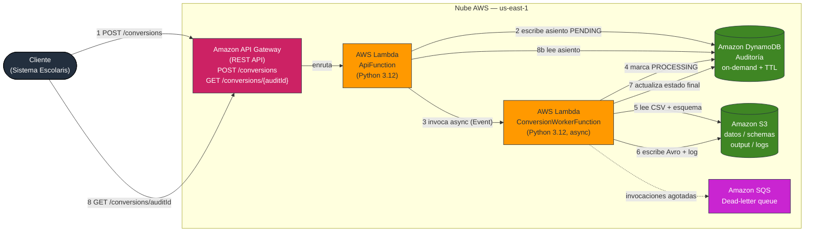
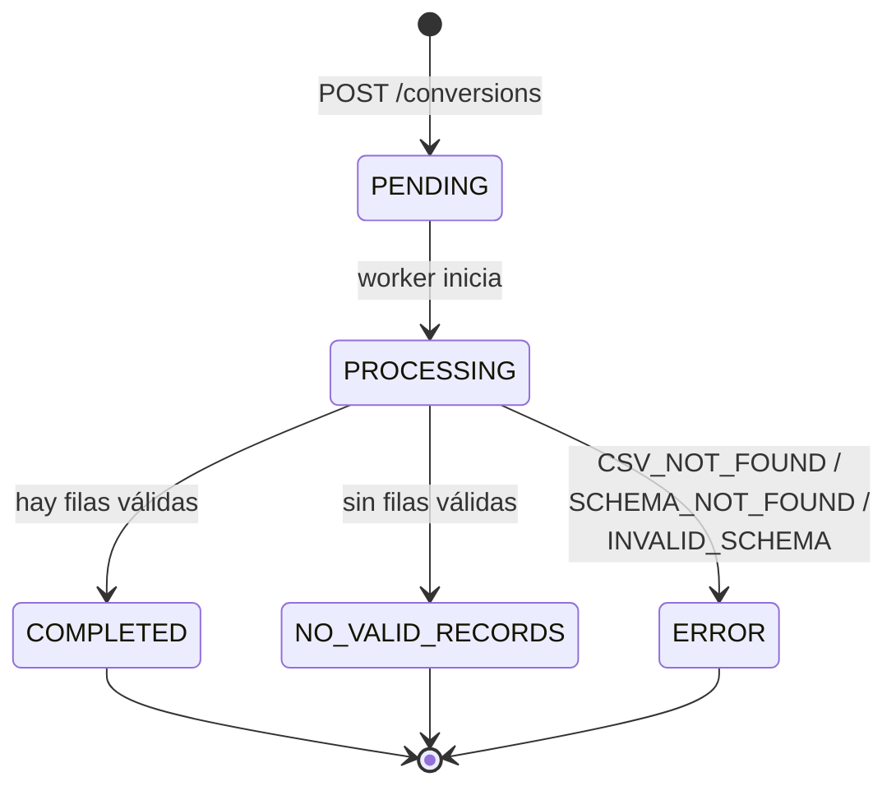

# Arquitectura — Avro REST API Gateway

> Diagrama de arquitectura del proyecto en formato Mermaid. Alternativa al `.drawio`
> canónico (T-04 BLOCKED hasta que el binario `aim` del MCP `drawio-architect` esté
> disponible). La numeración de los pasos coincide con la sección "Flujo de procesamiento"
> del `design.md`.

## Diagrama de componentes y flujo

## Leyenda del flujo

| # | Paso | Tipo |
|---|---|---|
| 1 | El cliente solicita la conversión en `POST /conversions` | sync |
| 2 | `ApiFunction` crea el asiento de auditoría en estado `PENDING` | sync |
| 3 | `ApiFunction` invoca al worker con `InvocationType=Event` | async |
| 4 | El worker marca el asiento como `PROCESSING` | sync |
| 5 | El worker lee el CSV y el esquema desde S3 | sync |
| 6 | El worker escribe el Avro (si hay filas válidas) y el log de inconsistencias | sync |
| 7 | El worker actualiza el asiento al estado final (`COMPLETED`, `NO_VALID_RECORDS` o `ERROR`) | sync |
| 8 | El cliente consulta el estado en `GET /conversions/{auditId}` (polling) | sync |
| — | Si el worker agota reintentos, el evento se envía a la DLQ (SQS) para diagnóstico | async |

## Estados del procesamiento

## Notas

- El bucket S3 **no es público**; el acceso es solo por roles IAM con privilegios mínimos.
- La tabla DynamoDB usa el atributo `ttl` (epoch Unix en segundos) para expirar asientos antiguos.
- El worker es **idempotente** respecto al `auditId`: si el asiento ya está en estado final, no reejecuta.
- Para renderizar: pega los bloques Mermaid en [mermaid.live](https://mermaid.live) o en cualquier
  visor compatible (VS Code con extensión Mermaid, GitHub, etc.).
